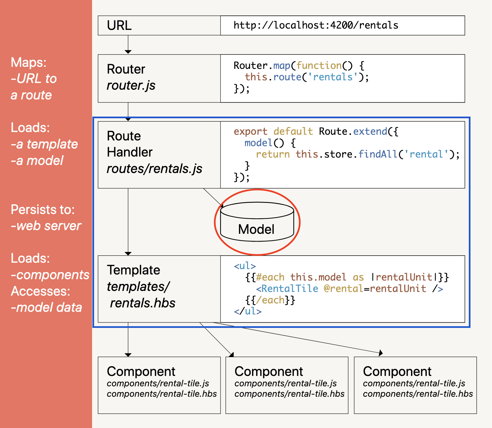

# 基本用法


### 给初学者

除了这本册子相信大家也看过其他的文章，有很多介绍对象模型的例子（特别是在 Ember Octane 以前）都直接使用了 `EmberObject` 来讲述，这可能会让初学者有一些困惑，因为在实际使用 Ember.js 框架的时候我们并不经常使用 `EmberObject` 的。在这里我需要解释一下：

1. 实际上 `EmberObject` 无处不在：`Route`，`Controller`，`Service`，`Component` 等等都是扩展自 `EmberObject` 的。我们很少直接使用它是因为大部分情况下框架都为我们准备好了更具体的基于 `EmberObject` 的子系统（比如上面列举的这些），又或者是我们不知道什么时候是直接使用 `EmberObject` 的好时机（这个已经不重要了，因为从 Ember Octane 开始就真的不再需要直接用它了）
2. 我们看到的教程一般都是为了讲解最核心、最基本的概念而设计的，所以会直接使用 `EmberObject`，因为它是 Ember Classic 对象模型里的根基；也可以这么说：只要能用它讲明白的问题，那么相同的理论运用在其他一切基于它的上层（比如 1. 里介绍的那些）身上都是一样的

接下来我们将基于 Ember Octane 来学习对象模型的基本知识，好消息是新的概念要比过去简单得多，比方说你不需要纠结“什么时候该用 `EmberObject` 而什么时候不必“等问题。希望上面的解释能让大家彻底丢掉过去的包袱，重新开始轻装上阵。


## 再见！`EmberObject` <a id="farewell-emberobject"></a>

Ember Octane 带来的最根本的变化就是对于原生类的完全兼容，要理解这一点我们来看一个例子：



比方说，我们可以通过后端 API 获得某位漫威英雄的基本信息：


```javascript
import Route from '@ember/routing/route';

export default class HeroRoute extends Route {
    async model() {
        let hero = await this.store.findRecord('hero', 'ironman');
        return hero;
    }
}
```


假定返回的数据结构如下图所示：


那么我们可以像这样来渲染模板：


```text
First Name: {{@model.firstName}}
Last Name: {{@model.lastName}}
```


如果我们要渲染一个全名呢？最单纯的做法无非是直接在模版上拼接：


```text
Full Name: {{@model.firstName}} {{@model.lastName}}
```


对于这个极简单的例子来说是没问题的，但现实情况下并不总是如此简单。请看 Demo 2：



比方说我们得到的数据变成了：


`dob` 是 Unix Timestamp 所表示的出生日期，如果我们要用对人类友好的方式来显示生日，那么就很难直接在模板上进行转换了。

在 Ember Classic 时代，上面的诉求通常都会经由 Controller 来帮我们实现，例如：


```javascript
import Controller from '@ember/controller';

export default class HeroController extends Controller {
    @computed('model.dob')
    get birthday() {
        let date = new Date(this.model.dob);
        return date.toDateString(); // => Sun Apr 4, 1965
    }
}
```


然后：

```text
Full Name: {{@model.firstName}} {{@model.lastName}}
Birthday: {{this.birthday}}
```

做到这一步似乎就已经大功告成了，但在这里我必须要指出：这样做是错误的！



我有一千个理由来陈述为什么不应该使用 Controller，在这里最合适的理由就是“职责混乱“。再看一眼最终的模板，我们发现：渲染姓名使用的是 `{{@model.xxx}}` 但渲染生日却用的是 `{{this.birthday}}`。这是因为 `birthday` 是我们在 Controller 里创造的衍生属性，可是直觉上又会觉得 `birthday` 不应该属于 Controller。



上图是官网文档中介绍框架结构的示意图，我们的演示集中在图中蓝色矩形里面的部分，红色圆圈里的 Model 就是通过路由 `model() {}` 返回的可供模板直接渲染的对象。在这里其实隐含了一个很关键的问题：**如果 `@model` 不够用怎么办？**

假如我们无视 Controller 的存在，那么惯例上我们可以通过创建 Component，然后在 Component 的内部完成对 `@model` 数据的进一步修饰（就好像 Demo 2 里创造的衍生属性 `birthday` 一样）。然而这么做有时候很合适，有时候则不一定，两者之间的分界在于我们要衍生的东西，究竟是属于哪边的？业务？还是 UI？

在我们这个例子里，很显然 `birthday` 和 UI 没有直接关系，它是 `@model.dob` 的以另外一种格式存在的数据。如果有一个 Component 需要渲染一位漫威英雄的基本资料，那么这个组件应该只需要接收到数据然后直接渲染就够了，数据要怎么“装饰“则超出了组件了职责范畴。

Controller 的问题就在于此：它不是组件，也不单纯是业务逻辑的领域；它介乎于二者之间的同时又有着独特的性质（比如说 Controller 都是单例对象且一旦生成就不会销毁）。所以它在 Ember.js 应用程序之中的职责总是模糊而暧昧的，那些非常依赖 Controller 的 Ember.js 应用程序总是看起来十分臃肿且晦涩难懂。

OK，Controller 不能用，Component 不见得合适，那么这个问题究竟应该如何处理较好呢？我们继续看 Demo 3：



这一次我们把生成衍生的 `birthday` 属性的职责转移到正确的地方——专门表示漫威英雄的 `Hero` Class：


```javascript
import EmberObject, { computed } from '@ember/object';
import Route from '@ember/routing/route';

class Hero extends EmberObject {
    @computed('firstName', 'lastName')
    get fullName() {
        return `${this.firstName} ${this.lastName}`;
    }

    @computed('dob')
    get birthday() {
        let date = new Date(this.model.dob);
        return date.toDateString(); // => Sun Apr 4, 1965
    }
}

export default class HeroRoute extends Route {
    async model() {
        let hero = await this.store.findRecord('hero', 'ironman');
        return Hero.create(hero);
    }
}
```


这也是 Ember Classic 时代我们做这样的事情需要依赖 `EmberObject` 的主要原因：我们的 `Hero` Class 需要 Computed Property 特性的支持。

于是我们的模版就可以写成：


```text
Full Name: {{@model.fullName}}
Birthday: {{@model.birthday}}
```


漂亮！你还可以看到我顺便也写了一个 `fullName` 属性，这当然不是必须的，但这么做会让模版变得更易读和易于维护。

然而本节内容的标题是：再见！`EmberObject`，所以这还没完，继续看 Demo 4：



之前说到，Ember Octane 是可以完全使用原生的 ES2015 Class 的，所以这个例子还可以进一步改进：


```javascript
import { computed } from '@ember/object';
import Route from '@ember/routing/route';

class Hero {
    constructor(attrs) {
        this.firstName = attrs.firstName || 'John';
        this.lastName = attrs.lastName || 'Doe';
        this.dob = attrs.dob || -2209017943000; // => Mon Jan 1, 1900
    }

    @computed('firstName', 'lastName')
    get fullName() {
        return `${this.firstName} ${this.lastName}`;
    }

    @computed('dob')
    get birthday() {
        let date = new Date(this.model.dob);
        return date.toDateString(); // => Sun Apr 4, 1965
    }
}

export default class HeroRoute extends Route {
    async model() {
        let hero = await this.store.findRecord('hero', 'ironman');
        return new Hero(hero);
    }
}
```


再见！`EmberObject`，这次是真的永别了。


### 给初学者

我们在例子中直接把 `Hero` Class 写在了 `app/routes/hero.js` 路由文件中，这当然是为了方便起见。

在真实项目中并不推荐这样做，而是应该单独创建一个 module，比如 `utils/hero.js`，然后 `export default class Hero { ... }`，最后在需要的地方 `import Hero from '...'` 来使用它。

另外，在例子中我还使用了 `this.store`，这其实是假定使用了 Ember Data。假如这个例子就是一个使用了 Ember Data 的项目，那么 `Hero` 实际上应该是一个 Ember Data Model，它的代码也应该是写在 `app/models/hero.js` 文件里。




关于 Native Class 在 Ember Octane 里的使用，还有一些细节需要强调一下。参照最后的代码例子：

* 使用 `new Model(attrs)` 实例化：`EmberObject` 提供了静态方法 `create` 来创建实例对象，它做了一些不透明的事情，比如说它会将传入的属性与原型对象进行合并，所以我们似乎不需要有一个“初始化“的过程（也就是在 Native Class 里 `constructor` 做的部分事情）。乍看起来这挺方便，但一方面是因为过去的对象模型是非标准化的，如果不自动帮用户做点事情，用户自己可能会搞得一团糟；另一方面这种“隐式“的逻辑反而会降低代码的可读性和可维护性，也不利于代码的内省。  当我们使用 Native Class 的时候，一切都按标准化的方式来，需要初始化的过程逻辑就写在 `constructor` 里。看似麻烦了些，但这是不需要额外的学习成本和理解负担的。 
* 因为 `EmberObject` 做了一些“隐式“的事情，所以即使用户希望附着一些自定义的初始化逻辑也不能依赖于 `constructor` 了。因为如果这些逻辑的前置依赖是来自 `EmberObject` 自身的行为（比如说合并初始参数进原型对象），那么在 `constructor` 里这一切都还没发生呢！所以 `EmberObject` 又提供了一个 `init() {}` 钩子，来确保用户自定义的初始化逻辑在正确的时间来执行。  然而这又带来了额外的学习成本和理解负担，幸好 Native Class 不存在这个问题，我们不再依赖 `EmberObject` 的特性，也就不再依赖它提供的额外的钩子方法来执行我们的自定义逻辑。 
* 如例子中所示，Computed Property 依然可用！这是因为 Ember Octane 的 CP macros（也就是 `@computed` 等等这些）就只是单纯的函数，我们完全可以把它们视为标准的装饰器函数来用（即：decorators）。  唯一需要注意的是：如果作为依赖的属性（比如前例中的 `dob`）需要改变，并且这种改变是应该让 CP 重新求值的，那么你依然需要使用 `Ember.set` 函数。且因为我们不再使用 `EmberObject` 了，所以 `this.set` 方法其实也不存在了，所以这种情况一定需要写成：  `import { set } from '@ember/object';  // 给作为依赖的属性设置新的值 set(this, 'dob', 1577808000000);  // 触发 CP 属性重新求值 this.birthday; // Wed Jan 1, 2020`

那么，有可能不再需要使用 `set` 来设置新值吗？这将是我们下一章将继续探讨的内容。

在本文的最后我放两张截图，它们分别是在 Ember Inspector 里看到的，继承自 `EmberObject` 的 `Hero` Class 和 Native `Hero` Class 的实例对象，给大家一个比较直观的感性对比：


